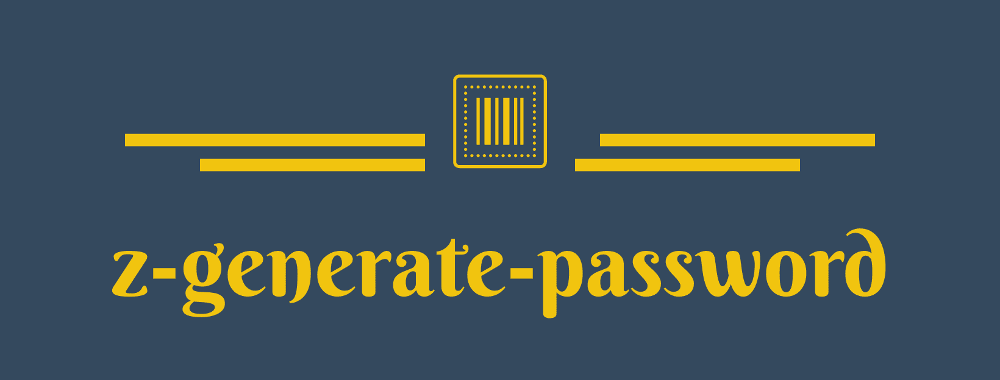

<div align='center'>



A 📦 tiny, 🚀 fast, 🎨 customizable password generator of javascript implement.

Default run as chrome builtin password generator.


[](https://www.npmjs.com/package/z-generate-password)

</div>

<hr/>

<div align='right'>

[English / [中文](README.zh-cn.md)]

</div>

## ✨ Features

-   🚀 Run fast (~1m ops/s by default, ~1.3m ops/s without shuffle [MacBook Air (M1, 2020) 16G])
-   🛡 Strong password have over 88 bits of entropy and fully tested
-   🎨 Fully customizable and readability (no similar chars or sequences of -/\_)
-   📦 Tiny and tree shaking support
-   🌎 Support web, Node and worker with esm, cjs amd umd

## 🎬 Quick Start

### Install

```js
npm i z-generate-password
```

### Usage

```ts
import generatePassword from 'z-generate-password';

console.log(generatePassword());
// yacpVZuF3TSQAjZn
```

### Passwords like

```
b2qaDfrH9BceXRWC
F68dVNajxdDUFRyq
9SXfA7u6rY4Ze57y
tF8BDUAb2TPS4S5y
2KVrtvTeGSwirJ8U
gSgSva3jy8ZYYtQh
yyRPhaf2jcMR2CVF
D4qfBTjfNNs96aWR
7sZZt69NdBtFJAPg
WgZmyt24DdLAAy5v
gS9Cjex2NkKie4c2
```

### Default generate rules

-   Must have lowercase char
-   Must have uppercase char
-   Must have digit
-   No sequences of -/\_

### Default chars

```ts
// exclude `l`, `o`
const DefaultLowerCaseChars = 'abcdefghijkmnpqrstuvwxyz';
// exclude 'I', 'O'
const DefaultUpperCaseChars = 'ABCDEFGHJKLMNPQRSTUVWXYZ';
// exclude '1'
const DefaultDigits = '23456789';
// symbols
const DefaultSymbols = '-_.:!';
```

Removed chars (for readability)

-   l (lowercase letter L)
-   I (capital letter i)
-   1 (digit one)
-   O (capital letter o)
-   0 (digit zero)
-   o (lowercase letter O)

## 🎨 Options

### Interface

```ts
{
    /** length of the password, pass a [min, max] as length range */
    length?: number | [number, number] | undefined;
    /** custom your symbol collection */
    symbols?: string | true | undefined;
    /** custom your digit collection */
    digits?: string | undefined;
    /** custom your lowercase char collection */
    lowerCaseChars?: string | undefined;
    /** custom your uppercase char collection */
    upperCaseChars?: string | undefined;
    /** add your own char collection */
    customChars?: string | undefined;
}
```

### Usage

```ts
const newPassword = generatePassword({
    length: [10, 20]
});
// EN3RBGJ3kG2A59SThy
```

### Use cases

-   custom password length

with fixed length

```ts
const newPassword = generatePassword({
    length: 18
});
// dJmFRniJ7gvWBq3vZp
```

with length range

```ts
const newPassword = generatePassword({
    length: [10, 20]
});
// EN3RBGJ3kG2A59SThy
```

-   custom symbols

with default symbols

```ts
const newPassword = generatePassword({
    symbols: true
});
// MS2_!U9ni.4QHaMk
```

with custom symbols

```ts
const newPassword = generatePassword({
    symbols: '@&*^'
});
// q2V^ppADRVEC3BVb
```

-   custom lowerCaseChars/upperCaseChars/digits

null to disabled some chars

```ts
const newPassword = generatePassword({
    digits: null
});
// fcQDHXaPWgsTtdUD
```

custom chars

```ts
const newPassword = generatePassword({
    lowerCaseChars: 'abc'
});
// aTZc9FC2T292Q24b
```

-   add custom chars

```ts
const newPassword = generatePassword({
    customChars: '我是中国人'
});
// RVg59M6CKP中i国4zT
```
