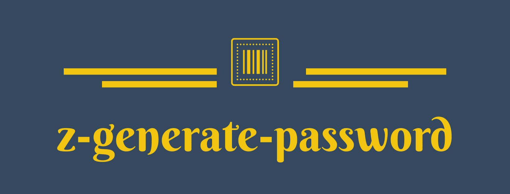

<div align='center'>



一个轻量、快速、可全面定制的 javascript 密码生成库。

默认行为遵循 chrome 内置的密码生成器


[](https://www.npmjs.com/package/@zlib/generate-password)

</div>

<hr/>

<div align='right'>

[[English](README.md) / 中文]

</div>

## ✨ 功能

-   🚀 快速 (默认情况下约 1m 次每秒, 关闭 shuffle 约达到 1.3m 次每秒 [MacBook Air (M1, 2020) 16G])
-   🛡 密码嫡超过 88 位，经过全面测试
-   🎨 完全可定制化，无阅读障碍（无相似字符和连续的 -/\_）
-   📦 轻量，支持 tree-shaking
-   🌎 提供 esm、cjs、umd，支持 web、Node、service worker

## 🎬 快速上手

### 安装

```js
npm i @zlib/generate-password
```

### 使用

```ts
import generatePassword from '@zlib/generate-password';

console.log(generatePassword());
// yacpVZuF3TSQAjZn
```

### 生成密码展示

```
b2qaDfrH9BceXRWC
F68dVNajxdDUFRyq
9SXfA7u6rY4Ze57y
tF8BDUAb2TPS4S5y
2KVrtvTeGSwirJ8U
gSgSva3jy8ZYYtQh
yyRPhaf2jcMR2CVF
D4qfBTjfNNs96aWR
7sZZt69NdBtFJAPg
WgZmyt24DdLAAy5v
gS9Cjex2NkKie4c2
```

### 默认的生成规则

-   必须有小写字母
-   必须有大写字母
-   必须有数字
-   没有连续的 `-` 或 `_`

### 默认的字符集

```ts
// exclude `l`, `o`
const DefaultLowerCaseChars = 'abcdefghijkmnpqrstuvwxyz';
// exclude 'I', 'O'
const DefaultUpperCaseChars = 'ABCDEFGHJKLMNPQRSTUVWXYZ';
// exclude '1'
const DefaultDigits = '23456789';
// symbols
const DefaultSymbols = '-_.:!';
```

移除的字符 (为了防止阅读出现问题)

-   l (小写 L)
-   I (大写 i)
-   1 (数字一)
-   O (大写字母 o)
-   0 (数字零)
-   o (小写字母 O)

## 🎨 Options

### 接口

```ts
{
    /** 生成密码的长度，可传入 [min, max] 数组来设置长度范围 */
    length?: number | [number, number] | undefined;
    /** 修改 symbol 的字符集，使用 true 为启用默认字符集 */
    symbols?: string | true | undefined;
    /** 修改数字的字符集 */
    digits?: string | undefined;
    /** 修改小写字母的字符集 */
    lowerCaseChars?: string | undefined;
    /** 修改大写字母的字符集 */
    upperCaseChars?: string | undefined;
    /** 添加自己的字符集 */
    customChars?: string | undefined;
}
```

### 使用

```ts
const newPassword = generatePassword({
    length: [10, 20]
});
// EN3RBGJ3kG2A59SThy
```

### 使用案例

-   定义密码长度

使用固定长度

```ts
const newPassword = generatePassword({
    length: 18
});
// dJmFRniJ7gvWBq3vZp
```

使用长度范围

```ts
const newPassword = generatePassword({
    length: [10, 20]
});
// EN3RBGJ3kG2A59SThy
```

-   修改符号字符集

使用默认符号字符集

```ts
const newPassword = generatePassword({
    symbols: true
});
// MS2_!U9ni.4QHaMk
```

自定义符号字符集

```ts
const newPassword = generatePassword({
    symbols: '@&*^'
});
// q2V^ppADRVEC3BVb
```

-   修改小写、大写、数字字符集

使用 `null` 来禁用对应字符集

```ts
const newPassword = generatePassword({
    digits: null
});
// fcQDHXaPWgsTtdUD
```

自定义字符集

```ts
const newPassword = generatePassword({
    lowerCaseChars: 'abc'
});
// aTZc9FC2T292Q24b
```

-   添加自定义字符集

```ts
const newPassword = generatePassword({
    customChars: '我是中国人'
});
// RVg59M6CKP中i国4zT
```
