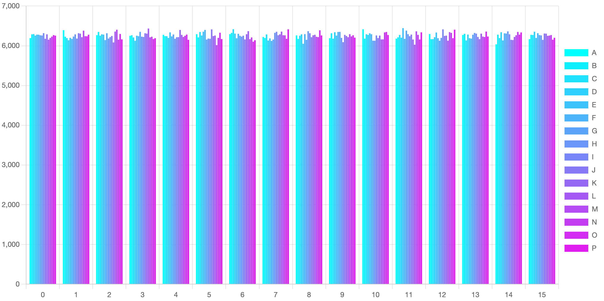

<div align='center'>


A tiny 📦 , fast 🚀 shuffle of javascript implement for array or string.


 

[](https://www.npmjs.com/package/z-shuffle)

</div>

<hr/>

<div align='right'>

[English / [中文](README.zh-cn.md)]

</div>

## ✨ Features

-   🚀 Run fast (1.5m ops/s for array of length 50 and 500k ops/s for string of length 62)
-   🌕 Support array or string
-   🕺🏻 Stable even distribution
-   📦 Tiny and tree shaking support
-   🌎 Support web, Node and worker with esm, cjs amd umd

## 🎬 Quick Start

### Install

```js
npm i z-shuffle
```

### Usage

```ts
import shuffle from 'z-shuffle';

console.log(shuffle(new Array(10).fill(null).map((v, i) => i)));
// [5, 3, 0, 1, 6, 9, 2, 4, 8, 7]
```

## 😼 Playground

[](https://codesandbox.io/s/playground-z-shuffle-kitsk?fontsize=14&hidenavigation=1&theme=dark)

## 🎨 Options

### Interface

```ts
declare function shuffle(
    target: string,
    option?: {
        fix?: true;
    }
): string;
declare function shuffle<T = any>(
    target: T[],
    option?: {
        pure?: boolean;
    }
): T[];
```

### Option

#### `fix` for string shuffle

For string shuffle, use `fix` to fix split for some special unicode char like `📦 🚀 `.

But if your string have some more special char like `👩🏾‍🔧`, you should use some lib to transform the string to an array
before shuffle.

#### `pure` for array shuffle

By default, shuffle will clone an array for do shuffle, but if you wan't this, just set `pure` to `false`.

## 📊 Distribution

This is a chart about do shuffle 100000 times for an array from A ～ P (16 letters for better display). The x axis means
the index of element in the array, the y axis means how much times the element appear to the index.

All elements's appear count to each index are around 6250 (100000/16), which means they are even distribution.

[](https://codesandbox.io/s/z-shuffle-distribution-chart-2j33q?fontsize=14&hidenavigation=1&theme=dark)


