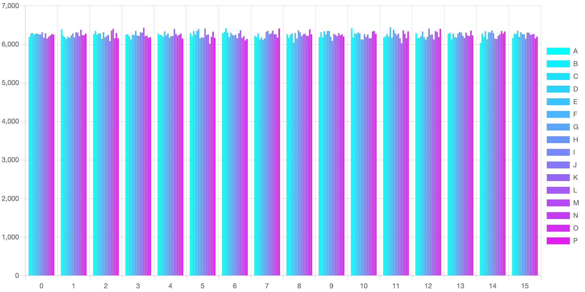

<div align='center'>


一个轻量的可以随机打乱数组/字符串顺序的 lib。


[](https://www.npmjs.com/package/z-shuffle)

</div>

<hr/>

<div align='right'>

[[English](README.md) / 中文]

</div>

## ✨ 功能

-   🚀 速度快
-   🌕 支持数组或字符串
-   🕺🏻 稳定的平均分布
-   📦 轻量，支持 tree-shaking
-   🌎 支持 esm、cjs、umd 引用，支持 web、nodejs、worker

## 🎬 快速上手

### 安装

```js
npm i z-shuffle
```

### 使用

```ts
import shuffle from 'z-shuffle';

console.log(shuffle(new Array(10).fill(null).map((v, i) => i)));
// [5, 3, 0, 1, 6, 9, 2, 4, 8, 7]
```

## 😼 尝试

[](https://codesandbox.io/s/zlib-shuffle-playground-kitsk?fontsize=14&hidenavigation=1&theme=dark)

## 🎨 Option

### 接口

```ts
declare function shuffle(
    target: string,
    option?: {
        fix?: true;
    }
): string;
declare function shuffle<T = any>(
    target: T[],
    option?: {
        pure?: boolean;
    }
): T[];
```

### Option

#### 关于字符串乱序的 `fix`

String 的乱序会优先转换为数组再去操作，而遇到一些复杂的 unicode 字符如 `📦 🚀 ` 等会出现问题，可以使用 `fix` 来修复。

但如果字符串存在复杂的 emoji 如`👩🏾‍🔧`，则需要借助其它专业库来实现（如 `runes`），可参考
[Playground](https://codesandbox.io/s/zlib-shuffle-playground-kitsk?file=/src/index.js)。

#### 关于数组乱序的 `pure`

默认情况下 shuffle 不会影响到原数组，如果需要直接在原数组上操作 shuffle，可以将 `pure` 设置为 `false`。

## 📊 排列分布图

下述图表为对一个 A-P 的数组进行 100000 次 shuffle 后的排列分布。x 轴为字母出现的索引位置，y 轴为出现的次数。

可以看到所有的字母在所有索引出现的次数都在 6250 (100000/16) 上下，可以看出分布均匀。

[](https://codesandbox.io/s/zlib-shuffle-distribution-chart-2j33q?fontsize=14&hidenavigation=1&theme=dark)


